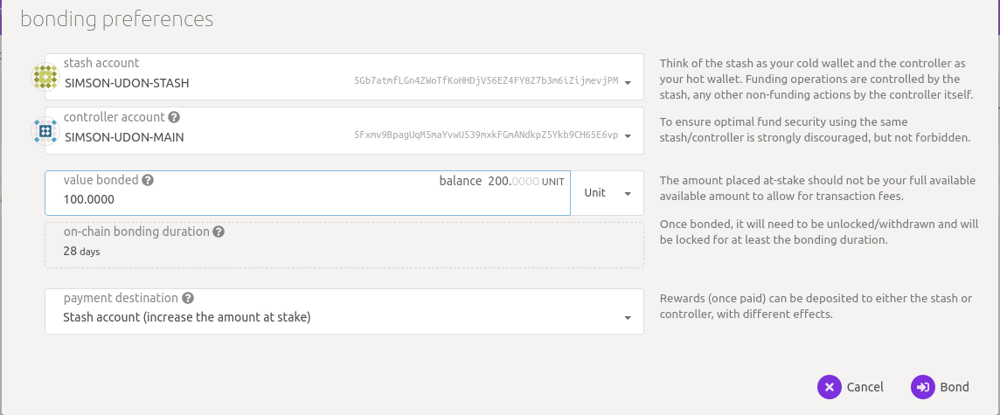
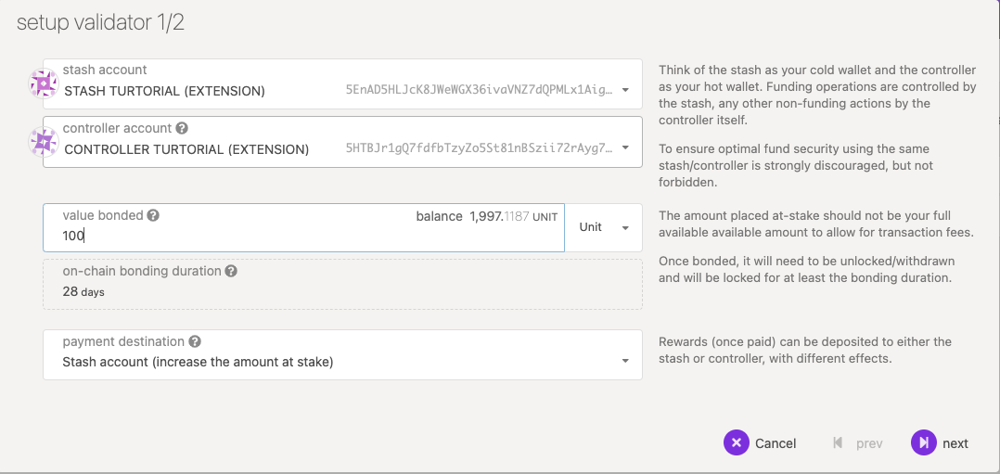
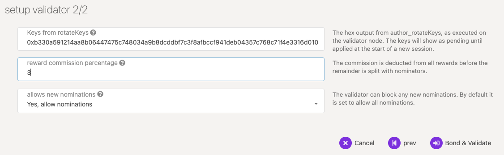

# Run a Validator (Polkadex)

This guide will instruct you how to set up a validator node on the Polkadex network.

## Initial Set-up

### Requirements

The most common way for a beginner to run a validator is on a cloud server running Linux. You may choose whatever VPS provider that your prefer, and whatever operating system you are comfortable with. For this guide we will be using <strong>Ubuntu 20.04</strong>, but the instructions should be similar for other platforms.

The transactions weights in Polkadot were benchmarked on standard hardware. It is recommended that validators run at least the standard hardware in order to ensure they are able to process all blocks in time. The following are not minimum requirements but if you decide to run with less than this beware that you might have performance issue.

#### Standard Hardware

For the full details of the standard hardware please see [here](https://github.com/paritytech/substrate/pull/5848)

- <strong>CPU</strong> - Intel(R) Core(TM) i7-7700K CPU @ 4.20GHz
- <strong>Storage</strong> - A NVMe solid state drive. Should be reasonably sized to deal with blockchain growth. Starting around 80GB - 160GB will be okay for the first six months of Polkadot, but will need to be re-evaluated every six months.
- <strong>Memory</strong> - 64GB

The specs posted above are by no means the minimum specs that you could use when running a validator, however you should be aware that if you are using less you may need to toggle some extra optimizations in order to be equal to other validators that are running the standard.

### Node Prerequisites: Install Rust and Dependencies

Once you choose your cloud service provider and set-up your new server, the first thing you will do is install Rust.

If you have never installed Rust, you should do this first.

If you have already installed Rust, run the following command to make sure you are using the latest version.

```
rustup update
```

If not, this command will fetch the latest version of Rust and install it.

```
curl https://sh.rustup.rs -sSf | sh -s -- -y
```

> If you do not have "curl" installed, run "sudo apt install curl"

To configure your shell, run the following command.

```
source $HOME/.cargo/env
```

Verify your installation.

```
rustc --version
```

Finally, run this command to install the necessary dependencies for compiling and running the Polkadot node software.

```
sudo apt install make clang pkg-config libssl-dev build-essential
```

Note - if you are using OSX and you have Homebrew installed, you can issue the following equivalent command INSTEAD of the previous one:

```
brew install cmake pkg-config openssl git llvm
```

### Install & Configure Network Time Protocol (NTP) Client

[NTP](https://en.wikipedia.org/wiki/Network_Time_Protocol) is a networking protocol designed to synchronize the clocks of computers over a network. NTP allows you to synchronize the clocks of all the systems within the network. Currently it is required that validators' local clocks stay reasonably in sync, so you should be running NTP or a similar service. You can check whether you have the NTP client by running:

If you are using Ubuntu 18.04 / 20.04, NTP Client should be installed by default.

```
timedatectl
```

If NTP is installed and running, you should see `System clock synchronized: yes` (or a similar message). If you do not see it, you can install it by executing:

```
sudo apt-get install ntp
```

ntpd will be started automatically after install. You can query ntpd for status information to verify that everything is working:

```
sudo ntpq -p
```

### Building and Installing the `Polkadex` binary

You will need to build the `Polkadex` binary from the [Polkadex-Substrate/Polkadex](https://github.com/Polkadex-Substrate/Polkadex) repository on GitHub using the source code available.

```
git clone https://github.com/Polkadex-Substrate/Polkadex.git
cd Polkadex
```

Build native code with the cargo release profile.

```
./scripts/init.sh
cargo build --release
```

<i>This step will take a while (generally 10 - 40 minutes, depending on your hardware).</i>

If you are interested in generating keys locally, you can also install `subkey` from the same directory. You may then take the generated `subkey` executable and transfer it to an air-gapped machine for extra security.

```
cargo install --force --git https://github.com/paritytech/substrate subkey
```

### Synchronize Chain Data

You can begin syncing your node by running the following command:

```
./target/release/polkadex-node --pruning=archive
```

if you do not want to start in validator mode right away.

```
[TODO] Need log here
```

Example of node sync:

```
[TODO] Need log here
```

The `--pruning=archive` flag is implied by the `--validator` flag, so it is only required explicitly if you start your node without one of these two options. If you do not set your pruning to archive node, even when not running in validator mode, you will need to re-sync your database when you switch.

If you are interested in determining how much longer you have to go, your server logs (printed to STDOUT from the `Polkadex` process) will tell you the latest block your node has processed and verified. You can then compare that to the current highest block via [Telemetry](https://telemetry.polkadot.io/#list/Polkadex%20Public%20Testnet) or the [PolkadotJS Block Explorer](https://polkadot.js.org/apps/?rpc=wss%3A%2F%2Fblockchain.polkadex.trade#/explorer).

## Bond PDEX

It is highly recommended that you make your controller and stash accounts be two separate accounts. For this, you will create two accounts and make sure each of them have at least enough funds to pay the fees for making transactions. Keep most of your funds in the stash account since it is meant to be the custodian of your staking funds.

Make sure not to bond all your PDEX balance since you will be unable to pay transaction fees from your bonded balance.

It is now time to set up our validator. We will do the following:

- Bond the PDEX of the Stash account. These PDEX will be put at stake for the security of the network and can be slashed.
- Select the Controller. This is the account that will decide when to start or stop validating.

First, go to the [Staking](https://polkadot.js.org/apps/?rpc=wss%3A%2F%2Fblockchain.polkadex.trade#/staking/actions) section. Click on "Account Actions", and then the "+ Stash" button.



- <strong>Stash account</strong> - Select your Stash account. In this example, we will bond 100 PDEX, where the minimum bonding amount is 100. Make sure that your Stash account contains at least this much. You can, of course, stake more than this.
- <strong>Controller account</strong> - Select the Controller account created earlier. This account will also need a small amount of PDEX in order to start and stop validating.
- <strong>Value bonded</strong> - How much PDEX from the Stash account you want to bond/stake. Note that you do not need to bond all of the PDEX in that account. Also note that you can always bond more PDEX later. However, withdrawing any bonded amount requires the duration of the unbonding period. On Polkadex, the planned unbonding period is 28 days.
- <strong>Payment destination</strong> - The account where the rewards from validating are sent. More info here. If you'd like to redirect payments to an account that is neither the controller nor the stash account, set one up. Note that it is extremely unsafe to set an exchange address as the recipient of the staking rewards.

Once everything is filled in properly, click `Bond` and sign the transaction with your Stash account.


After a few seconds, you should see an `ExtrinsicSuccess` message.

Your bonded account will available under `Stashes`. You should now see a new card with all your accounts (note: you may need to refresh the screen). The bonded amount on the right corresponds to the funds bonded by the Stash account.


### Set Session Keys

> <strong>Note:</strong> The session keys are consensus critical, so if you are not sure if your node has the current session keys that you made the `setKeys` transaction then you can use one of the two available RPC methods to query your node: [hasKey](https://polkadot.js.org/docs/substrate/rpc/#haskeypublickey-bytes-keytype-text-bool) to check for a specific key or [hasSessionKeys](https://polkadot.js.org/docs/substrate/rpc/#hassessionkeyssessionkeys-bytes-bool) to check the full session key public key string.

Once your node is fully synced, stop the process by pressing Ctrl-C. At your terminal prompt, you will now start running the node.

```
./target/release/polkadex-node --validator --name "name on telemetry"
```

You can give your validator any name that you like, but note that others will be able to see it, and it will be included in the list of all servers using the same telemetry server. Since numerous people are using telemetry, it is recommended that you choose something likely to be unique.

### Generating the Session Keys
You need to tell the chain your Session keys by signing and submitting an extrinsic. This is what associates your validator node with your Controller account on Polkadex.

#### Option 1: PolkadotJS-APPS
You can generate your `Session keys` in the client via the apps RPC. If you are doing this, make sure that you have the PolkadotJS-Apps explorer attached to your validator node. You can configure the apps dashboard to connect to the endpoint of your validator in the Settings tab. If you are connected to a default endpoint hosted by Polkadex Team, you will not be able to use this method since making RPC requests to this node would effect the local keystore hosted on a <i>public node</i> and you want to make sure you are interacting with the keystore for <i>your node</i>.

Once ensuring that you have connected to your node, the easiest way to set session keys for your node is by calling the `author_rotateKeys` RPC request to create new keys in your validator's keystore. Navigate to Toolbox tab and select RPC Calls then select the author > rotateKeys() option and remember to save the output that you get back for a later step.


#### Option 2: CLI

If you are on a remote server, it is easier to run this command on the same machine (while the node is running with the default HTTP RPC port configured):

```
curl -H "Content-Type: application/json" -d '{"id":1, "jsonrpc":"2.0", "method": "author_rotateKeys", "params":[]}' http://localhost:9933
```

The output will have a hex-encoded "result" field. The result is the concatenation of the four public keys. Save this result for a later step.

You can restart your node at this point.

#### Submitting the `setKeys` Transaction

You need to tell the chain your Session keys by signing and submitting an extrinsic. This is what associates your validator with your Controller account.

Go to [Staking > Account Actions](https://polkadot.js.org/apps/?rpc=wss%3A%2F%2Fblockchain.polkadex.trade#/staking/actions), and click "Set Session Key" on the bonding account you generated earlier. Enter the output from `author_rotateKeys` in the field and click "Set Session Key".

[TODO] need a screenshot here

Submit this extrinsic and you are now ready to start validating.

## Validate
To verify that your node is live and synchronized, head to [Telemetry](https://telemetry.polkadot.io/#list/Polkadex%20Public%20Testnet) and find your node. Note that this will show all nodes on the Polkadex network, which is why it is important to select a unique name!

In this example, we used the name `validator-test` and have successfully located it upon searching:

[TODO] need a screenshot here

### Setup via Validator Tab



Here you will need to input the Keys from `rotateKeys`, which is the Hex output from `author_rotateKeys`. The keys will show as pending until applied at the start of a new session.

The "reward commission percentage" is the commission percentage that you can declare against your validator's rewards. This is the rate that your validator will be commissioned with.

- <strong>Payment preferences</strong> - You can specify the percentage of the rewards that will get paid to you. The remaining will be split among your nominators.

> Note: setting a commission rate of 100% suggests that you do not want your validator to receive nominations.

You can also determine if you would like to receive nominations with the "allows new nominations" option.



Click "Bond & Validate".

If you go to the "Staking" tab, you will see a list of active validators currently running on the network. At the top of the page, it shows the number of validator slots that are available as well as the number of nodes that have signaled their intention to be a validator. You can go to the "Waiting" tab to double check to see whether your node is listed there.

[TODO] need a screenshot here

The validator set is refreshed every era. In the next era, if there is a slot available and your node is selected to join the validator set, your node will become an active validator. Until then, it will remain in the <i>waiting</i> queue. If your validator is not selected to become part of the validator set, it will remain in the <i>waiting</i> queue until it is. There is no need to re-start if you are not selected for the validator set in a particular era. However, it may be necessary to increase the number of PDEX staked or seek out nominators for your validator in order to join the validator set.

<strong>Congratulations!</strong> If you have followed all of these steps, and been selected to be a part of the validator set, you are now running a Polkadex validator!