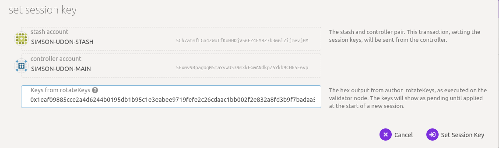
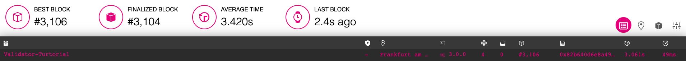
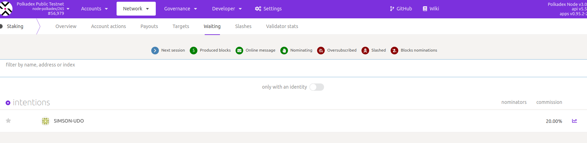

# Run a Validator (Polkadex)

This guide will instruct you how to set up a validator node on the Polkadex Public Testnet.

- **Github**: https://github.com/Polkadex-Substrate/Polkadex/releases/tag/v0.4.1-rc4
- **Bootnode IP address**: 13.235.92.50
- **Bootnode Peer ID**: 12D3KooWC7VKBTWDXXic5yRevk8WS8DrDHevvHYyXaUCswM18wKd
- **customSpecRaw.json** https://github.com/Polkadex-Substrate/Polkadex/releases/download/v0.4.1-rc4/customSpecRaw.json

## Initial Set-up

### Requirements

The most common way for a beginner to run a validator is on a cloud server running Linux. You may choose whatever VPS provider you prefer, and whichever operating system you are comfortable with. For this guide we will be using **Ubuntu 20.04**, but the instructions should be similar for other platforms.

The transaction weights in Polkadot were benchmarked on standard hardware. It is recommended that validators run at least the standard hardware in order to ensure they are able to process all blocks in time. The following are not minimum requirements but if you decide to run with less than this, you may experience performance issues.

#### Standard Hardware

For the full details of the standard hardware please see [here](https://github.com/paritytech/substrate/pull/5848)

- **CPU** - Intel(R) Core(TM) i7-7700K CPU @ 4.20GHz
- **Storage** - A NVMe solid state drive. Should be reasonably sized to deal with blockchain growth. Starting around 80GB - 160GB will be okay for the first six months of Polkadex, but will need to be re-evaluated every six months.
- **Memory** - 64GB

The specs posted above are by no means the minimum specs that you could use when running a validator, however you should be aware that if you are using less you may need to toggle some extra optimizations in order to match up to other validators that are running the standard.

### Node Prerequisites: Install Dependencies and Rust

Once you choose your cloud service provider and set-up your new server, the first thing you will do is install the necessary dependencies.

```
sudo apt install make clang pkg-config libssl-dev build-essential curl git
```

If you intend to build from source you need to install Rust first.

If you have already installed Rust, run the following command to make sure you are using the latest version.

```
rustup update
```

If not, this command will fetch the latest version of Rust and install it.

```
curl https://sh.rustup.rs -sSf | sh -s -- -y
```

Add the required toolchains with rustup

```
source $HOME/.cargo/env
rustup toolchain add nightly-2021-05-11
rustup target add wasm32-unknown-unknown --toolchain nightly-2021-05-11
rustup target add x86_64-unknown-linux-gnu --toolchain nightly-2021-05-11

```

Verify your installation.

```
rustc --version
```

Note - if you are using OSX and you have Homebrew installed, you can issue the following equivalent command INSTEAD of the previous one:

```
brew install cmake pkg-config openssl git llvm
```

### Install & Configure Network Time Protocol (NTP) Client

[NTP](https://en.wikipedia.org/wiki/Network_Time_Protocol) is a networking protocol designed to synchronize the clocks of computers over a network. NTP allows you to synchronize the clocks of all the systems within the network. Currently it is required that validators' local clocks stay reasonably in sync, so you should be running NTP or a similar service. You can check whether you have the NTP client by running:

If you are using Ubuntu 18.04 / 20.04, NTP Client should be installed by default.

```
timedatectl
```

If NTP is installed and running, you should see `System clock synchronized: yes` or a similar message. If you do not see it, you can install it by executing:

```
sudo apt-get install ntp
```

ntpd will be started automatically after install. You can query ntpd for status information to verify that everything is working:

```
sudo ntpq -p
```

### Building and Installing the `Polkadex` binary
#### Using a prebuilt
If you don't want to build the binary from source and simply prefer to download it, use the following command. Then continue at Synchronize Chain Data
`curl -O -L https://github.com/Polkadex-Substrate/Polkadex/releases/download/v0.4.1-rc4/PolkadexNodeUbuntu.zip ; unzip PolkadexNodeUbuntu.zip`

#### Build from source
To build the `Polkadex` binary from the [Polkadex-Substrate/Polkadex](https://github.com/Polkadex-Substrate/Polkadex) repository on GitHub using the source code available in the v0.4.1-rc4 release.

```
git clone https://github.com/Polkadex-Substrate/Polkadex.git
cd Polkadex
```

Build native code with the cargo release profile.

```
git checkout v0.4.1-rc4
cargo build --release
```

<i>This step will take a while (generally 10 - 40 minutes, depending on your hardware).</i>

### Synchronize Chain Data

Download `customSpecRaw.json` file for the Polkadex Public Testnet
```
cd $HOME
curl -O -L https://github.com/Polkadex-Substrate/Polkadex/releases/download/v0.4.1-rc4/customSpecRaw.json
```

You can begin syncing your node by running the following commands if you do not want to start in validator mode right away:

```
$HOME/Polkadex/target/release/polkadex-node --chain=$HOME/customSpecRaw.json --bootnodes /ip4/13.235.190.203/tcp/30333/p2p/12D3KooWC7VKBTWDXXic5yRevk8WS8DrDHevvHYyXaUCswM18wKd --pruning=archive
```


```
2021-08-17 12:46:37 Polkadex Node    
2021-08-17 12:46:37 ✌️  version 3.0.0-dbc98eca-x86_64-linux-gnu    
2021-08-17 12:46:37 ❤️  by Substrate DevHub <https://github.com/substrate-developer-hub>, 2017-2021    
2021-08-17 12:46:37 📋 Chain specification: Polkadex Public Testnet    
2021-08-17 12:46:37 🏷 Node name: utopian-ship-1166    
2021-08-17 12:46:37 👤 Role: FULL    
2021-08-17 12:46:37 💾 Database: RocksDb at /home/ubuntu/.local/share/polkadex-node/chains/polkadex_udon_net/db    
2021-08-17 12:46:37 ⛓  Native runtime: node-polkadex-265 (node-polkadex-1.tx2.au10)    
2021-08-17 12:46:39 🔨 Initializing Genesis block/state (state: 0x4702…ee26, header-hash: 0x4653…f69b)    
2021-08-17 12:46:39 👴 Loading GRANDPA authority set from genesis on what appears to be first startup.    
2021-08-17 12:46:39 ⏱  Loaded block-time = 3s from genesis on first-launch    
2021-08-17 12:46:39 👶 Creating empty BABE epoch changes on what appears to be first startup.    
2021-08-17 12:46:39 Using default protocol ID "sup" because none is configured in the chain specs    
2021-08-17 12:46:39 🏷 Local node identity is: 12D3KooWBch6ZrTHS8Svgs2GH8t497BittzFSWbCsgioShh8SiN1    
2021-08-17 12:46:39 📦 Highest known block at #0    
2021-08-17 12:46:39 〽️ Prometheus server started at 127.0.0.1:9615    
2021-08-17 12:46:39 Listening for new connections on 127.0.0.1:9944.    
```

Example of node sync:

```
2021-08-17 12:46:40 🔍 Discovered new external address for our node: /ip4/13.235.190.203/tcp/30333/p2p/12D3KooWC7VKBTWDXXic5yRevk8WS8DrDHevvHYyXaUCswM18wKd
2021-08-17 12:46:40 [#796] 🗳  Starting signed phase round 2.    
2021-08-17 12:46:40 [#838] 🗳  Starting unsigned phase(true).    
2021-08-17 12:46:40 [#882] 🗳  Finalized election round with compute ElectionCompute::OnChain.    
2021-08-17 12:46:40 [882] 💸 new validator set of size 2 has been processed for era 1    
2021-08-17 12:46:42 [#1863] 🗳  Starting signed phase round 3.    
2021-08-17 12:46:42 [#1909] 🗳  Starting unsigned phase(true).    
2021-08-17 12:46:42 [#1951] 🗳  Finalized election round with compute ElectionCompute::OnChain.    
2021-08-17 12:46:42 [1951] 💸 new validator set of size 2 has been processed for era 2    
2021-08-17 12:46:43 ✨ Imported #2631 (0x43ae…7b28)    
2021-08-17 12:46:44 💤 Idle (4 peers), best: #2631 (0x43ae…7b28), finalized #2629 (0x646d…9efc), ⬇ 155.3kiB/s ⬆ 3.6kiB/s    
2021-08-17 12:46:45 ✨ Imported #2632 (0xcad3…0e19)    
2021-08-17 12:46:48 ✨ Imported #2633 (0xedd3…a07d)    
2021-08-17 12:46:49 💤 Idle (4 peers), best: #2633 (0xedd3…a07d), finalized #2631 (0x43ae…7b28), ⬇ 1.3kiB/s ⬆ 1.4kiB/s    
2021-08-17 12:46:51 ✨ Imported #2634 (0xb743…0645)    
2021-08-17 12:46:54 ✨ Imported #2635 (0x46df…4b8a)    
2021-08-17 12:46:54 ✨ Imported #2635 (0x6e24…6988)    
2021-08-17 12:46:54 💤 Idle (4 peers), best: #2635 (0x46df…4b8a), finalized #2632 (0xcad3…0e19), ⬇ 1.4kiB/s ⬆ 1.4kiB/s    
2021-08-17 12:46:59 💤 Idle (4 peers), best: #2635 (0x46df…4b8a), finalized #2633 (0xedd3…a07d), ⬇ 0.8kiB/s ⬆ 0.6kiB/s
```

The `--pruning=archive` flag is implied by the `--validator` flag, so it is only required explicitly if you start your node without one of these two options. If you do not set your pruning to archive node, even when not running in validator mode, you will need to re-sync your database when you switch.

If you are interested in determining how much longer you have to go, your server logs (printed to STDOUT from the `Polkadex` process) will tell you the latest block your node has processed and verified. You can then compare that to the current highest block via [Telemetry](https://telemetry.polkadot.io/#list/Polkadex%20Public%20Testnet) or the [PolkadotJS Block Explorer](https://polkadot.js.org/apps/?rpc=wss%3A%2F%2Fblockchain.polkadex.trade#/explorer).

## Get Test Tokens on TestNet
In order to become a validator on the Polkadex Testnet, you will need some Test Tokens. The Polkadex team has designed a Twitter bot that will serve as a Test Token 'faucet' for this phase of the Testnet. **To claim Test Tokens, copy and paste the text below into a tweet, paste your account/wallet address where it says [ACCOUNT], and post it.** Soon after, you'll receive the Polkadex Test Tokens, and a like on the tweet.

```
👋 Hey @polkadex I would like to try the new test net. Please give me some #PolkadexTestTokens to my account [ACCOUNT]. Thanks for working hard!
```

## Bond PDEX
[Create two accounts](https://polkadot.js.org/apps/?rpc=wss%3A%2F%2Fblockchain.polkadex.trade#/accounts) [Here is one instruction video how to create accounts](https://www.youtube.com/watch?v=hhUZ40ZWqkE) and transfer some PDEX tokens to the main account.
It is highly recommended that you set your controller and stash accounts as two separate accounts. For this, you will need to create two accounts and make sure each of them have at least enough funds to pay the fees for making transactions. Keep most of your funds in the stash account since it is meant to be the custodian of your staking funds.

Make sure not to bond all your PDEX balance since you will be unable to pay transaction fees from your bonded balance.

It is now time to set up your validator. You will want to do the following:

- Bond the PDEX from your Stash account. These PDEX will be put at stake for the security of the network and can be slashed.
- Select the Controller. This is the account that will decide when to start or stop validating.

First, go to the [Staking](https://polkadot.js.org/apps/?rpc=wss%3A%2F%2Fblockchain.polkadex.trade#/staking/actions) section. Click on "Account Actions", and then the "+ Stash" button.


- **Stash account** - Select your Stash account. In this example, we will bond 100 PDEX, where the minimum bonding amount is 100. Make sure that your Stash account contains at least this much. You can, of course, stake more than this.
- **Controller account** - Select the Controller account created earlier. This account will also need a small amount of PDEX in order to start and stop validating.
- **Value bonded** - How much PDEX from the Stash account you want to bond/stake? You do not need to bond all of the PDEX in that account. Also note that you can always bond more PDEX later. However, withdrawing any bonded amount requires the duration of the unbonding period. On Polkadex, the planned unbonding period is 28 days.
- **Payment destination** - The account where the rewards from validating are sent. If you'd like to redirect payments to an account that is neither the controller nor the stash account, set one up. Please note that it is extremely unsafe to set an exchange deposit address as the recipient of the staking rewards.

Once everything is filled in properly, click `Bond` and sign the transaction with your Stash account.


After a few seconds, you should see an `ExtrinsicSuccess` message.

Your bonded account will be available under `Stashes`. You should now see a new card with all your accounts (note: you may need to refresh the screen). The bonded amount on the right corresponds to the funds bonded by the Stash account.


### Set Session Keys

> **Note:** The session keys are consensus critical, so if you are not sure if your node has the current session keys that you made with the `setKeys` transaction, then you can use one of the two available RPC methods to query your node: [hasKey](https://polkadot.js.org/docs/substrate/rpc/#haskeypublickey-bytes-keytype-text-bool) to check for a specific key or [hasSessionKeys](https://polkadot.js.org/docs/substrate/rpc/#hassessionkeyssessionkeys-bytes-bool) to check the full session key public key string.

Once your node is fully synced, stop the process by pressing Ctrl-C. At your terminal prompt, you will now start running the node.

```
$HOME/target/release/polkadex-node --chain=$HOME/customSpecRaw.json --bootnodes /ip4/13.235.190.203/tcp/30333/p2p/12D3KooWC7VKBTWDXXic5yRevk8WS8DrDHevvHYyXaUCswM18wKd --validator --name "Validator-Tutorial"
```
Similarly:
```
2021-08-17 12:50:57 Polkadex Node    
2021-08-17 12:50:57 ✌️  version 3.0.0-dbc98eca-x86_64-linux-gnu    
2021-08-17 12:50:57 ❤️  by Substrate DevHub <https://github.com/substrate-developer-hub>, 2017-2021    
2021-08-17 12:50:57 📋 Chain specification: Polkadex Public Testnet    
2021-08-17 12:50:57 🏷 Node name: Validator-Tutorial
2021-08-17 12:50:57 👤 Role: AUTHORITY
2021-08-17 12:50:57 💾 Database: RocksDb at /home/ubuntu/.local/share/polkadex-node/chains/polkadex_udon_net/db    
2021-08-17 12:50:57 ⛓  Native runtime: node-polkadex-265 (node-polkadex-1.tx2.au10)    
2021-08-17 12:50:57 Using default protocol ID "sup" because none is configured in the chain specs    
2021-08-17 12:50:57 🏷 Local node identity is: 12D3KooWBch6ZrTHS8Svgs2GH8t497BittzFSWbCsgioShh8SiN1    
2021-08-17 12:50:57 📦 Highest known block at #2687    
2021-08-17 12:50:57 〽️ Prometheus server started at 127.0.0.1:9615    
2021-08-17 12:50:57 Listening for new connections on 127.0.0.1:9944.    
2021-08-17 12:50:57 👶 Starting BABE Authorship worker
```

You can give your validator any name that you like, but note that others will be able to see it and it will be included in the list of all servers using the same telemetry server. Since numerous people are using telemetry, it is recommended that you choose something likely to be unique.

##### Running a validator as a service

Prepare a `validator.service` file
```
sudo vi /etc/systemd/system/validator.service
```

```
[Unit]
Description=Polkadex Testnet Validator Service
After=network-online.target
Wants=network-online.target

[Service]
User=ubuntu
Group=ubuntu
ExecStart=$HOME/Polkadex/target/release/polkadex-node --chain=$HOME/customSpecRaw.json --rpc-cors=all --bootnodes /ip4/13.235.190.203/tcp/30333/p2p/12D3KooWC7VKBTWDXXic5yRevk8WS8DrDHevvHYyXaUCswM18wKd --validator --name 'Validator-Tutorial'
Restart=on-failure

[Install]
WantedBy=multi-user.target
```

Run a validator as a service
```
sudo systemctl daemon-reload
sudo systemctl start validator
sudo systemctl status validator
```

### Generating the Session Keys
You need to tell the chain your Session keys by signing and submitting an extrinsic. This is what associates your validator node with your Controller account on Polkadex.

#### Option 1: PolkadotJS-APPS
You can generate your `Session keys` in the client via the apps RPC. If you are doing this, make sure that you have the PolkadotJS-Apps explorer attached to your validator node. You can configure the apps dashboard to connect to the endpoint of your validator in the Settings tab. If you are connected to a default endpoint hosted by the Polkadex Team, you will not be able to use this method since making RPC requests to this node would affect the local keystore hosted on a <i>public node</i> and you want to make sure you are interacting with the keystore for <i>your node</i>.

After ensuring you have connected to your node, the easiest way to set session keys for your node is by calling the `author_rotateKeys` RPC request to create new keys in your validator's keystore. Navigate to the Toolbox tab and select RPC Calls then select the author > rotateKeys() option and remember to save the output that you get back for a later step.


#### Option 2: CLI

If you are on a remote server, it is easier to run this command on the same machine (while the node is running with the default HTTP RPC port configured):

```
curl -H "Content-Type: application/json" -d '{"id":1, "jsonrpc":"2.0", "method": "author_rotateKeys", "params":[]}' http://localhost:9933
```

The output will have a hex-encoded "result" field. The result is the concatenation of the four public keys. Save this result for a later step.

You can restart your node at this point.

#### Submitting the `setKeys` Transaction

You need to tell the chain your Session keys by signing and submitting an extrinsic. This is what associates your validator with your Controller account.

Go to [Staking > Account Actions](https://polkadot.js.org/apps/?rpc=wss%3A%2F%2Fblockchain.polkadex.trade#/staking/actions), and click "Set Session Key" on the bonding account you generated earlier. Enter the output from `author_rotateKeys` in the field and click "Set Session Key".



Submit this extrinsic and you are now ready to start validating.

## Validate
To verify that your node is live and synchronized, head to [Telemetry](https://telemetry.polkadot.io/#list/Polkadex%20Public%20Testnet) and find your node. Note that this will show all nodes on the Polkadex network, which is why it is important to select a unique name for your node.

In this example, we used the name `Validator-Tutorial` and have successfully located it upon searching:



### Setup via Validator Tab


Here you will need to input the Keys from `rotateKeys`, which is the Hex output from `author_rotateKeys`. The keys will show as pending until applied at the start of a new session.

The "reward commission percentage" is the commission percentage that you can declare against your validator's rewards. This is the rate that your validator will be commissioned with.

- **Payment preferences** - You can specify the percentage of the rewards that will get paid to you. The remaining will be split among your nominators.

> Note: setting a commission rate of 100% suggests that you do not want your validator to receive nominations.

You can also determine if you would like to receive nominations with the "allows new nominations" option.


Click "Bond & Validate".

If you go to the "Staking" tab, you will see a list of active validators currently running on the network. At the top of the page, you will see the number of validator slots that are available as well as the number of nodes that have signaled their intention to be a validator. You can go to the "Waiting" tab to double check to see whether your node is listed there.



The validator set is refreshed every era. In the next era, if there is a slot available and your node is selected to join the validator set, your node will become an active validator. Until then, it will remain in the <i>waiting</i> queue. If your validator is not selected to become part of the validator set, it will remain in the <i>waiting</i> queue until it is. There is no need to re-start if you are not selected for the validator set in a particular era. However, it may be necessary to increase the number of PDEX staked or seek out nominators for your validator in order to join the validator set.

**Congratulations!** If you have followed all of these steps, and have been selected to be a part of the validator set, you are now running a Polkadex validator!
